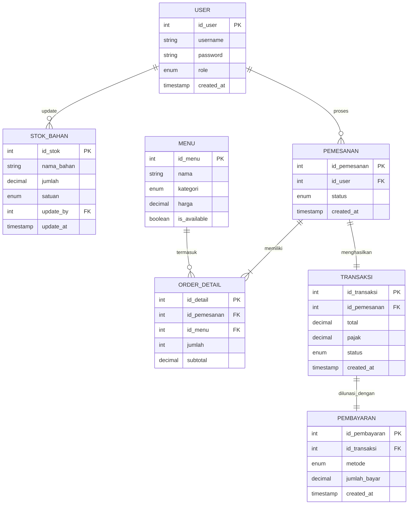

# DoBarPOS — Point of Sale & Activity Monitoring System 🏪☕

## 📌 Deskripsi Proyek
**DoBarPOS** adalah sistem informasi Point of Sale (POS) berbasis desktop *client-server* yang dirancang khusus untuk memenuhi kebutuhan operasional **DoBar Coffee Shop** (lokasi: Jl. Dg Tata 1 BTN Tabaria, Makassar). Aplikasi ini dikembangkan sebagai **Proyek Akhir Matakuliah Pemrograman Berorientasi Objek (PBO)** oleh **Kelompok 7**, Program Studi **Teknik Informatika dan Komputer, Fakultas Teknik, Universitas Negeri Makassar (UNM)**.

Sistem ini membantu digitalisasi seluruh alur transaksi, pengelolaan stok bahan baku secara real-time, manajemen menu makanan/minuman, pengelolaan akun karyawan (admin/kasir/manajer), hingga pembuatan laporan penjualan analitik yang dapat langsung diekspor ke dokumen PDF.

---

## 👥 Aktor & Hak Akses (Role-Based Access Control)
Sistem membedakan fungsi operasional berdasarkan peran pengguna yang login:

| Peran (Role) | Fitur & Hak Akses |
| :--- | :--- |
| **🛡️ Admin** | <ul><li>Mengelola data menu makanan & minuman (CRUD)</li><li>Mengelola data stok bahan baku (CRUD)</li><li>Mengelola data pengguna/akun karyawan (CRUD)</li><li>Melihat dashboard ringkasan sistem</li></ul> |
| **💵 Kasir** | <ul><li>Membuat pemesanan baru (POS Interface)</li><li>Penghitungan subtotal & pajak otomatis</li><li>Pilihan pembayaran (Cash / QRIS)</li><li>Menyimpan transaksi ke database & mencetak struk belanja</li><li>Melihat riwayat transaksi penjualan</li></ul> |
| **📈 Manager** | <ul><li>Melihat statistik ringkasan penjualan</li><li>Melihat laporan stok bahan ter-update</li><li>Mencetak/mengekspor laporan penjualan & laporan stok ke file **PDF**</li></ul> |

---

## 🛠️ Tech Stack & Dependencies
* **Bahasa Pemrograman:** Java SE (JDK 8 atau versi terbaru)
* **Antarmuka Grafis (GUI):** Java Swing (dirancang menggunakan NetBeans GUI Builder)
* **Database:** MySQL Server
* **Libraries / Dependencies (disediakan di folder `lib/`):**
  * `mysql-connector-j.jar` (Driver JDBC untuk koneksi database MySQL)
  * `itextpdf-5.5.13.3.jar` (Library untuk pembuatan dokumen laporan berformat PDF)
* **IDE Terkait:** NetBeans IDE

---

## 🗄️ Skema Database (MySQL)
Database proyek bernama **`dobarpos_db`** terdiri dari 8 tabel terelasi untuk mendukung integritas transaksi dan audit data:

1. **`user`**: Menyimpan kredensial login (username, hash password SHA2-256, dan role).
2. **`menu`**: Menyimpan data menu kopi, non-kopi, makanan, snack, harga, dan ketersediaan.
3. **`stok_bahan`**: Mencatat jumlah persediaan bahan baku beserta log admin terakhir yang memperbaruinya.
4. **`pemesanan`**: Mencatat transaksi pesanan aktif/selesai beserta kasir penanggung jawab.
5. **`order_detail`**: Menyimpan rincian item menu yang dipesan pada setiap transaksi.
6. **`transaksi`**: Menyimpan total nominal bayar, nilai pajak, status transaksi (`Paid`, `Void`, `Refund`).
7. **`pembayaran`**: Menyimpan metode pembayaran (`Cash`, `QRIS`, `Debit`) dan jumlah nominal yang dibayarkan.
8. **`laporan`**: Mencatat tanggal pencetakan laporan untuk keperluan audit manajemen.

### Diagram Relasi Tabel (Entity Relationship Diagram - ERD)

---

## 🧬 Penerapan Konsep PBO (Object-Oriented Programming)
Sebagai syarat utama proyek akhir matakuliah PBO, kode sumber aplikasi diimplementasikan dengan mematuhi prinsip pemrograman berorientasi objek berikut:

1. **Encapsulation (Pengkapsulan):**
   * Semua variabel instansiasi sensitif seperti properti user dilindungi dengan modifier akses `private`.
   * Akses dan perubahan nilai variabel dilakukan melalui metode accessor (`getter` dan `setter`).
   * Contoh: Penerapan pada kelas [UserSession.java](file:///d:/Coding/DoBarPOS/DoBarPOS/src/dobarpos/UserSession.java) untuk melindungi properti user yang aktif.

2. **Inheritance (Pewarisan):**
   * Layar GUI diturunkan langsung dari superclass framework Java Swing untuk mendaur ulang fungsionalitas window manager.
   * Contoh: `public class LoginFrame extends javax.swing.JFrame` mewarisi properti, behavior, dan metode manipulasi window Swing.

3. **Polymorphism (Polimorfisme):**
   * Override terhadap event handler untuk menyesuaikan aksi visual aplikasi.
   * Contoh: Mengoverride event focus listener pada kolom masukan username/password di layar login untuk menampilkan visual teks placeholder secara dinamis.

4. **Design Pattern (Singleton):**
   * Membatasi pembuatan instansiasi kelas tertentu agar hanya ada satu objek aktif demi menghemat memori.
   * Diterapkan pada kelas [DBConnection.java](file:///d:/Coding/DoBarPOS/DoBarPOS/src/dobarpos/DBConnection.java) (untuk mencegah pembuatan koneksi database MySQL berulang-ulang yang dapat membebani database server) dan [UserSession.java](file:///d:/Coding/DoBarPOS/DoBarPOS/src/dobarpos/UserSession.java) (untuk memastikan data login kasir/admin diakses secara global di frame manapun).

---

## ⚙️ Cara Instalasi & Menjalankan Aplikasi

### 1. Persiapan Awal
1. Pastikan Anda memiliki **Java JDK (versi 8 atau lebih baru)** terinstal di komputer.
2. Siapkan web server lokal MySQL, seperti **XAMPP**.
3. Pastikan driver library `lib/mysql-connector-j.jar` dan `lib/itextpdf-5.5.13.3.jar` tersemat di classpath proyek Java Anda.

### 2. Impor Database
1. Buka XAMPP Control Panel dan aktifkan modul **Apache** dan **MySQL**.
2. Akses phpMyAdmin di browser Anda (`http://localhost/phpmyadmin/`).
3. Buat database baru bernama **`dobarpos_db`**.
4. Pilih database tersebut, kemudian klik menu **Import** dan pilih file **[dobarpos_schema.sql](file:///d:/Coding/DoBarPOS/DoBarPOS/dobarpos_schema.sql)** yang berada di folder utama proyek untuk membuat tabel beserta data testing awal (*seed data*).

### 3. Eksekusi Program
Anda dapat menjalankan aplikasi menggunakan salah satu metode di bawah ini:

* **Metode A: Melalui Script Batch (Cepat)**
  Cukup klik dua kali pada file **[Run_DoBarPOS.bat](file:///d:/Coding/DoBarPOS/DoBarPOS/Run_DoBarPOS.bat)** di sistem operasi Windows. File ini akan otomatis mengonfigurasi classpath driver database dan meluncurkan antarmuka login.
  
* **Metode B: Melalui NetBeans IDE**
  1. Buka IDE NetBeans.
  2. Pilih `File` -> `Open Project`, lalu arahkan ke direktori folder proyek `DoBarPOS`.
  3. Pastikan library di dalam folder `lib/` sudah terhubung pada properties proyek (*Libraries* -> *Compile*).
  4. Klik kanan project, pilih **Run** (atau tekan tombol `F6`).

---

## 🔑 Akun Pengujian (Testing Credentials)
Gunakan akun uji coba berikut untuk menguji masing-masing level hak akses peran:

| Level Akses | Username | Password | Deskripsi Pengujian |
| :--- | :--- | :--- | :--- |
| **🛡️ Admin** | `admin_super` | `admin123` | Kelola menu makanan, kelola kuantitas bahan baku, kelola tambah karyawan baru. |
| **💵 Kasir** | `budi_kasir` / `siti_kasir` | `kasir123` | Lakukan pemesanan kasir, pilih pembayaran cash, input jumlah uang kembali, simpan, cetak struk belanja, dan cek riwayat transaksi. |
| **📈 Manager** | `yaya_manager` | `manager123` | Buka menu laporan, pilih filter, ekspor laporan penjualan/laporan stok bahan ke file PDF eksternal. |

---

*© 2026 DoBarPOS — Teknik Informatika & Komputer FT-UNM. Hak Cipta Dilindungi.*
